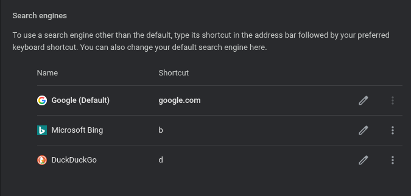
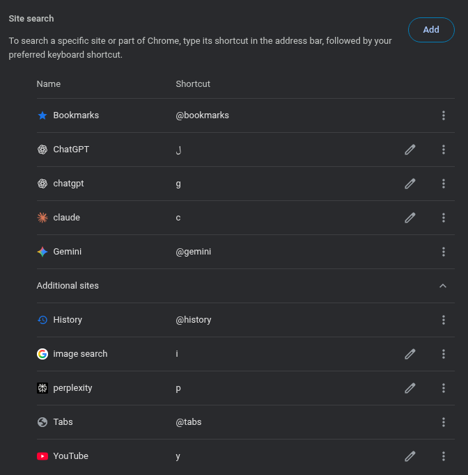

# Mastering Chrome's Search Shortcuts

## By the end of this guide, you will be able to:

- Understand the difference between search engines and site search.
- Configure and use Chrome's address bar for faster, more targeted searching.
- Set up custom search shortcuts for your favorite sites and search engines.

## Why use Chrome's shortcuts for searching

- Save time by searching specific sites directly from the address bar
- Access multiple search engines quickly without changing your default
- Avoid navigating to websites before searching
- Customize shortcuts to match your workflow and frequently used sites

## Address bar

The address bar (also known as the URL bar, location bar, or Omnibox in some browsers) is a user interface element in web browsers and file browsers. In web browsers, it's the field where you can type a website's address (URL) to navigate to that page or enter a search query. In file browsers, it serves a similar purpose, allowing users to navigate within the file system.

## The difference between searching through search engines and site search

The primary difference lies in the scope of the search. Search engines like Google scour the entire internet for information, while site search (also known as website search) is limited to the content within a specific website.

## Managing search engines and site search

### Activation Keys

In the address bar, you need to press an activation key after typing your search shortcut to trigger the custom search engine or site search. Chrome offers two settings for this:

**Option 1: Space or Tab** (Default)

- After typing your shortcut, press either Space or Tab to activate it

**Option 2: Tab only**

- After typing your shortcut, only Tab will activate it (Space won't work)

### Search engines

- You can choose your default search engine, edit its name and shortcut, and
  delete it, but you can't add new search engines.

### Site search

- You can add custom site searches, and edit them.

#### Best site search shortcuts

| Name         | Shortcut | URL Template                                           |
| ------------ | -------- | ------------------------------------------------------ |
| YouTube      | y        | https://www.youtube.com/results?search_query=%s        |
| ChatGPT      | g        | https://chatgpt.com/?q=%s                              |
| Image Search | i        | https://www.google.com/search?tbm=isch&q=%s            |
| Perplexity   | p        | https://www.perplexity.ai/search?q=%s                  |
| Claude       | c        | https://claude.ai/new?q=%s                             |
| Wikipedia    | w        | https://en.wikipedia.org/wiki/Special:Search?search=%s |

#### How to know the URL template of a site search

You can simply ask any AI bot like ChatGPT, Gemini, or Claude to tell you the URL template of a site search.

## Setting up custom shortcuts

1. Go to `chrome://settings/searchEngines`
2. Click "Add" next to "Site search"
3. Enter the site name, your preferred shortcut, and the URL template
4. Click "Add" to save your custom shortcut

## How to use search shortcuts

1. **Type your shortcut** in the address bar (e.g., "y" for YouTube)
2. **Press Space or Tab** - you'll see the search engine name appear
3. **Enter your search query** and press Enter
4. **Example:** Type "y" + Space + "funny cats" to search YouTube directly

## Glossary

- **Address Bar**: The field at the top of a browser where web addresses or search queries are entered. Also known as the URL bar or Omnibox.
- **Scope**: The extent or range something covers, such as the reach of a search engine or site search.
- **Scour**: To thoroughly search through data or content to locate something specific.
- **Search Engine**: An online tool (like Google or Bing) that searches across the internet to retrieve relevant content.
- **Site Search**: A search functionality limited to the contents of a specific website.
- **URL**: Stands for Uniform Resource Locator; it’s the complete web address used to locate a page on the internet (e.g., `https://www.google.com`).

## Resources

- [Manage search engines and site search](chrome://settings/searchEngines)
- [Set default search engine and site search shortcuts](https://support.google.com/chrome/answer/95426)
